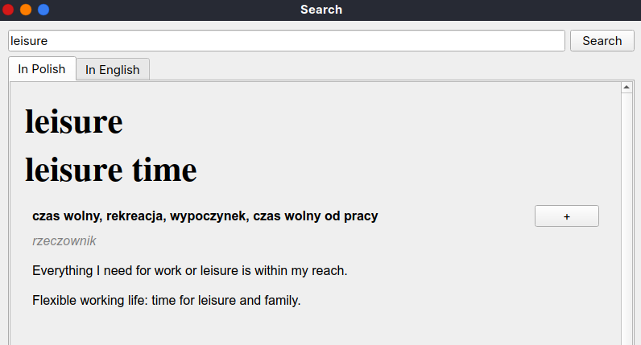
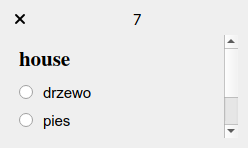
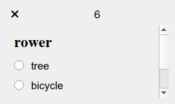
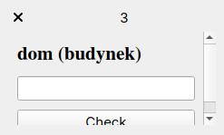

A combination of dictionary and SRS (spaced repetition software). Allows you to quickly search for a meaning of a given word and add it to a database for spaced repetition.

# Functionalities
The program works in background and can be accessed through the system tray icon.

## Searching for definitions of words
In the search window you can enter a word of the language you are learning and the program will output lists of meanings of the word in languages you are familiar with (at the moment only English -> Polish and English -> English translations are available). Clicking the "+" button next to a meaning will add the meaning to a database storing all the definitions of words you've learnt so far. To open the search window, click on the system tray icon and choose the *Search* option. Alternatively, you can use a hotkey (currently it is hard-coded to be `Super+S`). 



## Spaced repetition system
As soon as you add at least 3 meanings to the database, the program will start generating quizzes about the words you've learnt. The quizzes are small windows that pop up in the top right corner of the screen at certain intervals (you can specify exactly how often in *Settings*). Each of them contains a question about a random word-definition pair from the database. The difficulty level of a quiz depends on how well you know the particular meaning it concerns. There are essentially 3 difficulty levels:

* level 1 - choose a definition matching the given word


* level 2 - choose a word matching the given definition


* level 3 - enter a word matching the given definition



Note that a question may have many correct answers. If your answer is correct, the knowledge level of the meaning corresponding to the question and your answer is increased. However, if it is not, the knowledge levels of the meanings corresponding to the question and every possible correct answer are decreased.

# Installation
1. Create a Python virtual environment and activate it.

On Linux:
```
python3 -m venv .venv
source .venv/bin/activate
```
On Windows:
```
py -3 -m venv .venv
.venv\scripts\activate
```
2. Install necessary packages:

On Linux:
```
python3 -m pip install -r requirements.txt
```
On Windows:
```
python -m pip install -r requirements.txt
```

# Launching
On Linux:
```
source .venv/bin/activate
python3 main.py
```
On Windows:
```
.venv\scripts\activate
python main.py
```

# To do
* mp3 pronounciation in the search window
* viewing and deleting meanings from the database